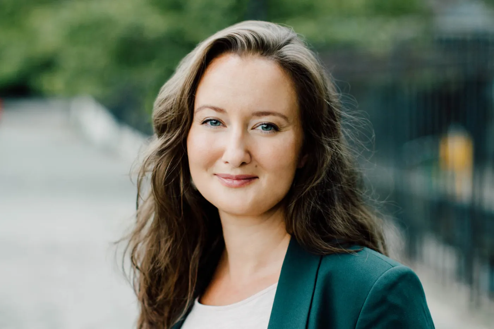

# Proto-persona — [Nombre del emprendimiento]

> Guía: [Proto-persona](../evaluacion/guias/fase-1-requerimientos/02-proto-persona.md)

## Proto-persona principal

**Camila, 32 años.** Diseñadora de Interiores e Ilustradora Freelance.

> "Busco llevar la tranquilidad de la naturaleza y los paisajes reales a los espacios urbanos en los que vivimos."

### Comportamientos

- Le gusta hacer trekking y escapar a entornos naturales durante los fines de semana.
- Es muy activa en Instagram y Pinterest, donde busca inspiración sobre decoración minimalista.
- Prefiere comprar a artistas e iniciativas locales antes que en grandes tiendas retail.
- Valora las compras con historia y empaques amigables con el medio ambiente.

### Necesidades

- Encontrar impresiones fotográficas de alta calidad para decorar proyectos residenciales de sus clientes.
- Conocer la historia detrás de cada fotografía y la ubicación geográfica de los paisajes y los entornos naturales de cada obra.
- Acceder a opciones de enmarcado y formatos listos para colgar que sean duraderos y de buena calidad.

### Motivaciones

- Apoyar el talento fotográfico nacional y el arte local independiente.
- Transmitir serenidad, autenticidad y belleza orgánica en los ambientes que diseña.
- Conectar emocionalmente con la conservación del patrimonio natural chileno.

### Frustraciones

- Ver fotografías publicitarias genéricas, demasiado retocadas, abuso de la IA y repetitivas de bancos de imágenes.
- Comprar impresiones en línea que llegan con mala resolución, colores distorsionados o materiales frágiles.
- La falta de transparencia sobre los procesos de producción o envíos de los artistas.